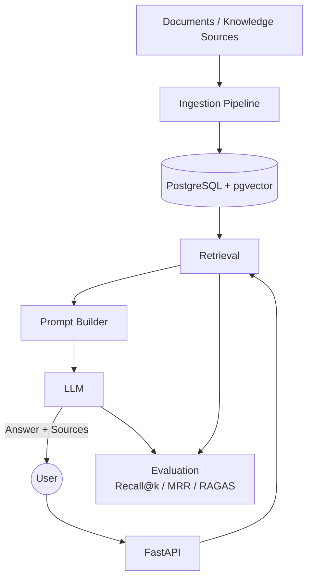

# local-rag-system

[](https://github.com/ajits-github/local-rag-system/actions/workflows/ci.yml)

A modular, config-driven local RAG system: sentence-transformers embeddings,
Postgres+pgvector storage, Ollama generation, FastAPI serving. Every infra
choice (embedding model, vector backend, chunker, reranker, LLM) is
swappable via `config/default.yaml`: nothing is hardcoded, so comparative
experiments can change one axis without touching pipeline code. Runs fully
offline on a CPU-only, 8GB-RAM machine; no API keys required by default.

The fastest path is: install Python dependencies, start Postgres, ingest
`data/sample_docs`, start the API, and call `/query`.

## Architecture



For the detailed system view, see [`docs/architecture.md`](docs/architecture.md).

| Component | Current implementation | Configurable / future |
|---|---|---|
| Embeddings | all-MiniLM-L6-v2 | swappable |
| Vector DB | PostgreSQL + pgvector | swappable |
| Chunker | structured Markdown | swappable |
| Retrieval | dense or hybrid search | configurable |
| Reranker | optional cross-encoder | Cohere / none |
| LLM | Qwen2.5 via Ollama | swappable |
| Prompt | versioned YAML templates | configurable |
| Evaluation | Recall@k, MRR, RAGAS | extensible |

## Agentic RAG

`POST /agent/query` is an optional bounded workflow above the classic
`POST /query` path. It can route simple questions to classic RAG and use a
small tool loop for complex or multi-hop questions. The graph is bounded
by `max_agent_steps`, `max_retrieval_attempts`, and `max_tool_calls`, and
uses the same retrieval authorization, freshness, redaction, and injection
checks as the classic path.

The details live in [`docs/architecture.md`](docs/architecture.md).

## Observability

Operational telemetry on top of the agentic workflow: per-node timing
(with a real-LLM-inference-vs-overhead split), OpenTelemetry traces,
Prometheus metrics, a local Grafana dashboard, and a safe live-progress
SSE stream (`POST /agent/query/stream`). Distinct from
[MLflow tracking](#mlflow-tracking) below, which tracks experiment runs,
not live requests.

`/metrics` (Prometheus text exposition) and the SSE stream are on by
default (`observability.metrics.enabled`/`observability.live_events.enabled`,
both true no-ops with nothing scraping/consuming them); OpenTelemetry
tracing is off by default (`observability.tracing.enabled: false`) since
it needs a real OTLP endpoint to be useful.

To see traces and dashboards locally:
```
# set observability.tracing.enabled: true in config/default.yaml first
make observability-up
```
This brings up Jaeger (traces, `http://localhost:16686`), Prometheus
(`http://localhost:9090`), and Grafana (`http://localhost:3000`,
pre-provisioned with a dashboard) alongside the base stack, layered via
`docker compose -f docker-compose.yml -f docker-compose.observability.yml
up -d`, never brought up by plain `make up`. Teardown: `make
observability-down`.

The details live in [`docs/architecture.md`](docs/architecture.md)'s
"Observability" section.

## Prerequisites

- Python 3.11+
- [Docker](https://www.docker.com/) (for the Postgres+pgvector container)
- [Ollama](https://ollama.com/) installed, **running**, and with
  `qwen2.5:1.5b` pulled:
  ```
  ollama pull qwen2.5:1.5b
  ```
  Ollama usually starts automatically after install; verify it's actually
  serving with `ollama list` (or `curl http://localhost:11434/api/version`).
  If it's installed but not on your PATH, invoke it by its full path (e.g.
  on Windows: `C:\Users\<you>\AppData\Local\Programs\Ollama\ollama.exe`).
- **`make`**: optional shortcut for `up`/`ingest`/`query`/`test`.
  **Not installed by default on Windows** (neither Git Bash nor PowerShell
  ship it). Install it via `choco install make`, `scoop install make`, or
  WSL, *or* skip it entirely and run the underlying command shown next to
  each `make` target below. The Makefile uses `bash`, so native
  PowerShell users should prefer the explicit commands.

## Setup

1. Create a virtualenv and install the project.
   PowerShell:
   ```
   python -m venv .venv
   .\.venv\Scripts\Activate.ps1
   pip install -e ".[dev]"
   ```
   macOS/Linux:
   ```
   python -m venv .venv
   source .venv/bin/activate
   pip install -e ".[dev]"
   ```
2. Copy `.env.example` to `.env` and adjust if needed. `DATABASE_URL` points
   at Postgres on **host port 15987** (not the default 5432) so it won't
   collide with any other local Postgres instance:
   ```
   cp .env.example .env
   ```
   Already have a Postgres+pgvector container running locally? Point
   `DATABASE_URL` at it directly instead of step 3's `docker-compose.yml`
   (match `POSTGRES_DB` to its real name), then still run
   `python scripts/init_db.py` (idempotent) to create/migrate the schema.
3. Bring up Postgres+pgvector and initialize the schema:
   ```
   make up
   ```
   Without `make`, run the two steps it wraps:
   ```
   docker compose up -d
   python scripts/init_db.py
   ```
   If `init_db.py` cannot connect immediately, wait until the
   `local-rag-postgres` container is healthy and run it again.
4. Ingest the bundled smoke-test documents.
   ```
   make ingest FILE=data/sample_docs DATASET_ID=sample_docs
   ```
   Without `make`:
   ```
   python -m rag.ingestion.pipeline data/sample_docs --dataset-id sample_docs
   ```
   Any file or directory can be ingested. Use a different `--dataset-id`
   when you ingest a separate corpus.

   Re-running ingestion on unchanged files is a no-op (checksum-based, no
   duplicate chunks); edited files are detected and re-chunked in place
   under the same `document_id`.
5. Start the API:
   ```
   uvicorn rag.api.main:app --reload
   ```
   Then hit `GET /health`, `POST /ingest`, `POST /query`, or browse
   `/docs` / `/redoc`.
6. Query via the Makefile once the API is running:
   ```
   make query Q="What are the deployment windows for production releases?"
   ```
   Without `make`:
   ```
   curl -s -X POST http://localhost:8000/query -H "Content-Type: application/json" -d '{"query": "What are the deployment windows for production releases?"}'
   ```
   Filter retrieval by the `category` metadata preserved from folder
   structure; only meaningful once you've ingested a dataset with
   subfolders (`data/sample_docs/` is flat, so this is illustrative rather
   than directly runnable against it):
   ```
   curl -s -X POST http://localhost:8000/query -H "Content-Type: application/json" \
     -d '{"query": "What MFA methods are approved?", "filters": {"category": "security"}}'
   ```

## Containerized development

Postgres+pgvector and the API can both run in containers. Ollama usually
stays native on the host, and the API container reaches it through
`host.docker.internal`. Requires **Docker Compose V2**.

```
docker compose up -d --build          # first build pulls ~1-2GB of ML deps (PyTorch); later ones are cached
python scripts/init_db.py             # against the containerized Postgres, via DATABASE_URL in .env
curl http://localhost:8000/health     # {"vectorstore":"ok","llm":"ok"} confirms it reached both deps
scripts/smoke_test_containers.sh      # full ingest -> query round trip, one shot
docker compose down                   # add -v to also drop the pgdata volume
```
Ingest/query work exactly as in native dev, same port/endpoints. `src/`
and `config/` are bind-mounted with `--reload`, so Python edits need no
rebuild. Only `pyproject.toml` changes require rebuilding the image.

**Production-shaped run**: `docker-compose.prod.yml` drops the bind
mounts and `--reload`, stops publishing Postgres's port, and tightens
health-check timing (same-host "productionized," not a Kubernetes
substitute):
```
docker compose -f docker-compose.yml -f docker-compose.prod.yml up -d --build
```

**Running the API against an alternate config file**: `RAG_CONFIG_PATH`
(unset by default) overrides which YAML the API loads instead of
`config/default.yaml`. `config/` is already bind-mounted into the
container at `/app/config`, so any file under `config/experiments/` is
reachable by its in-container path. Set it in the host shell before
bringing the stack up (`docker-compose.yml` forwards it through
unchanged; it is never hardcoded there):
```
RAG_CONFIG_PATH=/app/config/experiments/agentic-rag-baseline-v1.yaml docker compose up -d
```
An unset or empty value preserves the default behavior exactly. A path
that doesn't exist, or isn't valid YAML, fails loudly at config-load time
rather than silently falling back to `config/default.yaml`.

### Windows-specific notes

- `host.docker.internal` (used to reach native Ollama) is a Docker Desktop
  feature; `docker-compose.yml` also adds `extra_hosts:
  host.docker.internal:host-gateway` so it resolves on native Linux too.
- Docker Desktop's Windows file sharing doesn't enforce host-side POSIX
  permissions, so the non-root `rag` user can read/write the bind-mounted
  volumes without any `chown`/`chmod` step (native Linux would need the
  container UID to match the host user's).
- The embedding model downloads from Hugging Face Hub on first use inside
  a fresh container/volume if not already cached. It needs outbound internet
  that one time, same as native.

## Configuration

All provider choices and tunables live in `config/default.yaml`:
embedding model, chunk size/overlap, reranker (`none` / `cross_encoder` /
`cohere`), LLM, retrieval `candidate_k`, generation context size, security
toggles, and agent bounds. Point at an alternate config with
`--config path/to/other.yaml` on the ingestion/eval CLIs, or edit the
default file directly for local experiments. The running API (not a CLI)
instead reads the `RAG_CONFIG_PATH` environment variable, unset by
default; see "Running the API against an alternate config file" above.

Generation prompts are versioned YAML files under
`src/rag/prompts/templates/` (`rag_answer_v1.yaml`, `rag_answer_v2.yaml`,
...), loaded and validated by `src/rag/prompts/loader.py`. The active
version is selected by `config/default.yaml`'s `generation.prompt` block
(`id`, `version`, `path`); `RetrievalPipeline` loads it once at
construction and rejects the file if its own declared `prompt_id`/`version`
don't match what's configured.

## Metadata & filtering

Every chunk carries source metadata such as `document_id`, `chunk_id`,
`source`, `source_type`, timestamps, language, `category`, governance
fields, and structural fields. For directory ingestion, `category` is the
file's path relative to the ingested root, such as `security` or
`security/subteam`.

`POST /query` accepts exact-match filters for approved metadata fields.
The most common filter is `category`.

## Evaluation

`data/eval/sample_gold.jsonl` is a small smoke-test gold file for
`data/sample_docs`. Run it after the sample dataset is ingested:

```
python -m rag.eval.run_eval --gold data/eval/sample_gold.jsonl --dataset-id sample_docs
```
`--dataset-id` is mandatory and is injected as a filter on every retrieval.
Reports include Recall@5/10, Hit Rate@5/10, MRR, latency, and a simple
keyword-overlap answer-quality score. Add `--verbose` for per-question
details or `--skip-generation` for retrieval-only metrics.

### RAGAS generation-quality evaluation (optional)

RAGAS scoring is optional and uses a separately configured judge model.
Install the extra only if you plan to run it:
```
pip install .[ragas]         # local (ollama) judge
pip install .[ragas,anthropic]  # + hosted anthropic judge
```
The judge is selected in `config/default.yaml` under `judge:`. Hosted
judges read API keys from environment variables; no key is hardcoded.

```
python -m rag.eval.run_ragas_eval --gold data/eval/sample_gold.jsonl \
    --dataset-id sample_docs --verbose > /tmp/ragas_report.json
```
`--sample-size` defaults to 15 so hosted judging can be tested cheaply
before scaling up. Judge calls are cached under `.cache/ragas` by default.

RAGAS scores should be checked against human labels before treating them
as project quality gates:
```
python scripts/generate_manual_review.py --eval-output /tmp/ragas_report.json --num-rows 10
# ... fill in the human_faithful/human_correct/human_relevant/human_correct_refusal
# fields in the generated JSONL by hand ...
python scripts/compare_ragas_manual.py --ragas-output /tmp/ragas_report.json \
    --manual-review data/eval/manual_review/sample_docs_manual_review.jsonl
```
The comparison report shows where the judge agrees or disagrees with the
human labels.

## Benchmarks

`experiments/` tracks comparable eval runs over time: `configs/` holds a
snapshot of `config/default.yaml` per experiment, `results/` holds a flat
JSON metrics record per experiment (schema below), and `reports/` holds
the generated comparison table. Only aggregate metrics and config values
are stored here, never corpus content or generated answers, so all three
are safe to commit even though the underlying dataset isn't (per dataset
above).

The table below is generated, not hand-written; don't edit it directly,
regenerate it instead (see "Recording a new experiment").

<!-- EXPERIMENTS_TABLE_START -->
| # | Label | Retrieval | Generation model | Embedder | Reranker | Prompt | Rel.Exp | Recall@5 | Recall@10 | Hit Rate@10 | MRR | Answer quality | Supp.Ctx Hit | Img Hit | RAGAS Faithful | RAGAS Correct | Total latency | Dataset | Date |
|---|---|---|---|---|---|---|---|---|---|---|---|---|---|---|---|---|---|---|---|
| 1 | TechFusion baseline (qwen2.5:1.5b, no reranker) | dense | qwen2.5:1.5b | all-MiniLM-L6-v2 | none | - | - | 0.891 | 0.967 | 0.978 | 0.847 | 0.432 | - | - | - | - | 3.7s | techfusion | 2026-08-05 |
| 2 | qwen2.5:3b (candidate generation model) | dense | qwen2.5:3b | all-MiniLM-L6-v2 | none | - | - | 0.891 | 0.967 | 0.978 | 0.847 | 0.453 | - | - | - | - | 12.1s | techfusion | 2026-08-05 |
| 3 | qwen2.5:3b + cross_encoder reranker | dense | qwen2.5:3b | all-MiniLM-L6-v2 | cross_encoder (ms-marco-MiniLM-L-6-v2) | - | - | 0.891 | 0.967 | 0.978 | 0.822 | 0.507 | - | - | - | - | 10.1s | techfusion | 2026-08-05 |
| 4 | qwen2.5:3b + cross_encoder + BGE-small embedder | dense | qwen2.5:3b | bge-small-en-v1.5 | cross_encoder (ms-marco-MiniLM-L-6-v2) | - | - | 0.902 | 0.935 | 0.957 | 0.825 | 0.483 | - | - | - | - | 10.3s | techfusion-bge-small | 2026-08-05 |
| 5 | qwen2.5:3b + cross_encoder + BGE-small + chunk_size=300 | dense | qwen2.5:3b | bge-small-en-v1.5 | cross_encoder (ms-marco-MiniLM-L-6-v2) | - | - | 0.902 | 0.946 | 0.957 | 0.808 | 0.427 | - | - | - | - | 9.9s | techfusion-bge-small-chunk300 | 2026-08-05 |
| 6 | structured_markdown chunker (62-question gold set, tables/code/config/chart) | dense | qwen2.5:1.5b | all-MiniLM-L6-v2 | none | v1 | - | 0.919 | 0.952 | 0.968 | 0.865 | 0.387 | - | - | - | - | 2.8s | techfusion | 2026-08-06 |
| 7 | RAGAS pilot (OpenAI gpt-4o-mini judge, 15-question stratified sample) | dense | qwen2.5:1.5b | all-MiniLM-L6-v2 | none | v1 | - | 1.000 | 1.000 | 1.000 | 0.906 | 0.348 | - | - | 0.844 | 0.471 | 3.0s | techfusion | 2026-08-06 |
| 8 | RAGAS full evaluation (OpenAI gpt-4o-mini judge, all 62 questions) | dense | qwen2.5:1.5b | all-MiniLM-L6-v2 | none | v1 | - | 0.919 | 0.952 | 0.968 | 0.865 | 0.413 | - | - | 0.786 | 0.469 | 4.4s | techfusion | 2026-08-06 |
| 9 | hybrid retrieval (BM25+dense, RRF k=60) pilot vs. experiment_007 dense baseline | hybrid | qwen2.5:1.5b | all-MiniLM-L6-v2 | none | v1 | - | 0.900 | 1.000 | 1.000 | 0.822 | 0.378 | - | - | 0.820 | 0.591 | 3.0s | techfusion | 2026-08-06 |
| 10 | hybrid retrieval (BM25+dense, RRF k=60, punctuation-aware tokenizer) full 62-question vs. experiment_008 dense baseline | hybrid | qwen2.5:1.5b | all-MiniLM-L6-v2 | none | v1 | - | 0.903 | 0.944 | 0.952 | 0.865 | 0.391 | - | - | 0.841 | 0.504 | 2.1s | techfusion | 2026-08-07 |
| 11 | Multimodal milestone Experiment A: prompt v2, hybrid+RRF (matches experiment_010), text-only image handling, relationship expansion OFF, hosted vision OFF | hybrid | qwen2.5:1.5b | all-MiniLM-L6-v2 | none | v2 | off | 0.911 | 0.946 | 0.952 | 0.824 | 0.413 | 0.697 | 0.579 | - | - | 5.2s | techfusion | 2026-08-11 |
| 12 | Multimodal milestone Experiment B: identical to experiment_011 except relationship expansion ON (parent+neighbors, max 3) | hybrid | qwen2.5:1.5b | all-MiniLM-L6-v2 | none | v2 | on | 0.911 | 0.946 | 0.952 | 0.824 | 0.418 | 0.788 | 0.842 | - | - | 13.7s | techfusion | 2026-08-11 |
| 13 | prompt v2 + relationship expansion + RAGAS (15-q stratified sample) | hybrid | qwen2.5:1.5b | all-MiniLM-L6-v2 | none | v2 | on | 0.800 | 0.867 | 0.867 | 0.697 | 0.328 | 0.625 | 0.875 | 0.700 | 0.409 | 7.4s | techfusion | 2026-08-12 |
| 14 | qwen2.5:3b generation model (vs experiment_012's qwen2.5:1.5b), full 84 questions, prompt v2 + relationship expansion | hybrid | qwen2.5:3b | all-MiniLM-L6-v2 | none | v2 | on | 0.911 | 0.946 | 0.952 | 0.824 | 0.452 | 0.788 | 0.842 | - | - | 19.2s | techfusion | 2026-08-12 |
| 15 | Biggest config: qwen2.5:3b + prompt v2 + hybrid+relationship expansion + RAGAS, full 84 questions | hybrid | qwen2.5:3b | all-MiniLM-L6-v2 | none | v2 | on | 0.911 | 0.946 | 0.952 | 0.824 | 0.442 | 0.788 | 0.842 | 0.898 | 0.513 | 18.4s | techfusion | 2026-08-12 |
| 16 | cutoff-semantics refactor baseline (qwen2.5:3b, hybrid+RRF, rel-exp on, reranker=none) | hybrid | qwen2.5:3b | all-MiniLM-L6-v2 | none | v2 | on | 0.911 | 0.946 | 0.952 | 0.824 | 0.440 | 0.788 | 0.842 | - | - | 24.3s | techfusion | 2026-08-13 |
| 17 | cross-encoder reranker vs no-reranker baseline (qwen2.5:3b, hybrid+RRF, rel-exp on) | hybrid | qwen2.5:3b | all-MiniLM-L6-v2 | cross_encoder (ms-marco-MiniLM-L-6-v2) | v2 | on | 0.929 | 0.940 | 0.940 | 0.826 | 0.453 | 0.803 | 0.842 | - | - | 24.3s | techfusion | 2026-08-13 |
| 18 | context/latency A: qwen3b ctx3 tok512 (rel-exp best config) | hybrid | qwen2.5:3b | all-MiniLM-L6-v2 | none | v2 | on | 0.911 | 0.946 | 0.952 | 0.824 | 0.437 | 0.788 | 0.842 | - | - | 25.5s | techfusion | 2026-08-14 |
| 19 | context/latency B: qwen3b ctx2 tok512 | hybrid | qwen2.5:3b | all-MiniLM-L6-v2 | none | v2 | on | 0.911 | 0.946 | 0.952 | 0.824 | 0.415 | 0.788 | 0.842 | - | - | 33.5s | techfusion | 2026-08-14 |
| 20 | context/latency C: qwen3b ctx2 tok256 | hybrid | qwen2.5:3b | all-MiniLM-L6-v2 | none | v2 | on | 0.911 | 0.946 | 0.952 | 0.824 | 0.427 | 0.788 | 0.842 | - | - | 6.3s | techfusion | 2026-08-14 |
| 21 | context/latency A RAGAS (15q sample): qwen3b ctx3 tok512 | hybrid | qwen2.5:3b | all-MiniLM-L6-v2 | none | v2 | on | 0.800 | 0.867 | 0.867 | 0.697 | 0.304 | 0.625 | 0.875 | 0.868 | 0.320 | 14.8s | techfusion | 2026-08-14 |
| 22 | context/latency B RAGAS (15q sample): qwen3b ctx2 tok512 | hybrid | qwen2.5:3b | all-MiniLM-L6-v2 | none | v2 | on | 0.800 | 0.867 | 0.867 | 0.697 | 0.374 | 0.625 | 0.875 | 0.833 | 0.339 | 15.4s | techfusion | 2026-08-14 |
| 23 | context/latency C RAGAS (15q sample): qwen3b ctx2 tok256 | hybrid | qwen2.5:3b | all-MiniLM-L6-v2 | none | v2 | on | 0.800 | 0.867 | 0.867 | 0.697 | 0.374 | 0.625 | 0.875 | 0.905 | 0.302 | 9.0s | techfusion | 2026-08-14 |
| 24 | classic_rag_baseline_v1 | hybrid | qwen2.5:3b | all-MiniLM-L6-v2 | none | v2 | on | 0.911 | 0.946 | 0.952 | 0.824 | 0.448 | 0.788 | 0.842 | 0.902 | 0.503 | 24.9s | techfusion | 2026-08-14 |
| 25 | secure_rag_baseline_v1_auth_disabled | hybrid | qwen2.5:3b | all-MiniLM-L6-v2 | none | v3 | on | 0.861 | 0.929 | 0.937 | 0.768 | 0.370 | 0.733 | 0.842 | - | - | 28.2s | techfusion | 2026-08-14 |
| 26 | secure_rag_baseline_v1 | hybrid | qwen2.5:3b | all-MiniLM-L6-v2 | none | v3 | on | 0.788 | 0.832 | 0.865 | 0.753 | 0.390 | 0.781 | 0.842 | - | - | 28.5s | techfusion | 2026-08-14 |
| 27 | secure_rag_baseline_v1_field_redaction | hybrid | qwen2.5:3b | all-MiniLM-L6-v2 | none | v3 | on | 0.788 | 0.832 | 0.865 | 0.753 | 0.405 | 0.781 | 0.842 | - | - | 21.7s | techfusion | 2026-08-15 |
| 28 | secure_rag_baseline_v2_jwt_auth | hybrid | qwen2.5:3b | all-MiniLM-L6-v2 | none | v3 | on | 0.788 | 0.832 | 0.865 | 0.753 | 0.420 | 0.781 | 0.842 | - | - | 20.6s | techfusion | 2026-08-15 |
<!-- EXPERIMENTS_TABLE_END -->

*Total latency is the mean retrieval plus generation time per question.
Every row is measured with `dataset_id`-isolated retrieval, so results are
not mixed across datasets in the same vector store.*

Detailed experiment writeups live in `experiments/reports/`,
[`docs/architecture.md`](docs/architecture.md), and `PROJECT_JOURNAL.md`.
The README keeps the comparison table so changes remain visible at a
glance without turning this file into an experiment log.

### Agentic RAG benchmarks

The table above is classic-RAG only (Recall/MRR/answer_quality). The
agentic evaluation (`rag.eval.run_agent_eval`, 18-question
`data/eval/agentic_extension_gold.jsonl`) reports a different metric
family, so it gets its own small table here instead of being forced into
incompatible columns. Recorded by hand from
`experiments/results/agentic/*.json`; not wired into
`scripts/compare_experiments.py`, which targets the classic-RAG schema
only.

| # | Label | Classify prompt | Synthesize prompt | Routing accuracy | Unnecessary agent rate | Citation support | Answer correctness | RAGAS Faithful | RAGAS Correct | Mean latency | Dataset | Date |
|---|---|---|---|---|---|---|---|---|---|---|---|---|
| 29 | agentic_rag_baseline_v1 | v1 | v1 | 0.833 | 1.000 | 0.111 | 0.449 | 0.443 | 0.584 | 138.5s | techfusion | 2026-08-21 |
| 32 | agentic_rag_baseline_v2_fixed | v2 | v2 | 0.889 | 0.000 | 1.000 | 0.463 | 0.511 | 0.531 | 47.4s | techfusion | 2026-08-21 |

Experiment 32 fixed the two issues experiment 29 found: `agent_classify_v2`
makes the simple/complex routing boundary explicit (cut the unnecessary
-agent rate to 0.0 and mean latency 2.9x, purely via routing composition),
and `agent_synthesize_v2` plus a code-level evidence-ordering fix makes an
authoritative source always take priority over an untrusted, conflicting
one at synthesis time (raised citation support 0.111 to 1.000). Full
before/after numbers and per-question trace validation:
`experiments/reports/agentic_rag_baseline_v2_fixed.md`.

### Recording a new experiment

1. Change one thing in `config/default.yaml` (reranker, model, chunk size,
   prompt version, ...).
2. Run the eval and save its full report (or `rag.eval.run_ragas_eval` for
   the RAGAS-scored variant, see above):
   ```
   python -m rag.eval.run_eval --gold data/eval/sample_gold.jsonl \
     --dataset-id sample_docs --verbose > /tmp/eval_report.json
   ```
3. Register it as an experiment (never re-runs eval, just records the
   report above):
   ```
   python scripts/record_experiment.py --eval-output /tmp/eval_report.json \
     --experiment-id experiment_002 --label "cross-encoder reranker" \
     --config config/default.yaml
   ```
   Captures every config axis (embedding model, chunk size, reranker,
   prompt version + checksum, and RAGAS scores if present) and also logs
   an MLflow run (see "MLflow tracking" below), unless `mlflow.enabled:
   false`.
4. Regenerate the comparison table (updates
   `experiments/reports/comparison.md` and this README section in place):
   ```
   python scripts/compare_experiments.py
   ```
   Pass `--exclude experiment_id[,experiment_id...]` to leave a
   non-comparable record (e.g. a small pilot run at a different sample
   size) out of the table.

### MLflow tracking

Every `scripts/record_experiment.py` call also logs an MLflow run (config
as params, metrics, and the eval-output/record/config files as artifacts),
under a readable run name like `experiment_015_qwen2-5-3b_v2_hybrid_rel-exp`
(display-only; the real MLflow run UUID is unaffected) and tagged with
`experiment_id`/`label`/`generation_model`/`prompt_version`/
`retrieval_provider`/`reranker_provider`/`relationship_expansion`/
`dataset_id` for fast filtering in the MLflow UI. Requires the `mlflow`
extra (`pip install .[mlflow]`). It fails loudly rather than silently
skipping if enabled but not installed. Local by default, no server
required (`mlflow.tracking_uri: sqlite:///mlflow.db`):
```
mlflow ui --backend-store-uri sqlite:///mlflow.db
```
`scripts/backfill_mlflow.py` re-logs every `experiments/results/*.json`
into MLflow in one pass, useful if `mlflow.db`/`mlruns/` is ever deleted.

## Testing

```
make test
```
Without `make`: `pytest tests/ -v`.

Unit tests (`tests/unit`) mock all external I/O and always run. Integration
tests (`tests/integration`) assume Postgres (`make up`) and a local Ollama
with `qwen2.5:1.5b` are already running, and skip with a clear message if
either is unreachable.

`scripts/smoke_test_containers.sh` is a separate check for the
containerized setup specifically: it assumes `docker compose up -d` (or
the prod-override form) is already running, and proves the *containerized*
API can reach Postgres+pgvector and native Ollama, then does a real
ingest -> query round trip against them (see
[Containerized development](#containerized-development) above).

## Continuous Integration

`.github/workflows/ci.yml` runs on every PR/push to `main` (and via manual
`workflow_dispatch`), in four parallel jobs:

- **code-quality**: `pre-commit run --all-files` (ruff, ruff-format, mypy,
  hygiene hooks; the same checks `pre-commit install` runs locally).
- **unit-tests**: the full `tests/unit` suite; no external services.
- **integration-tests**: `tests/integration` against a `pgvector/pgvector:pg16`
  service container spun up by the workflow itself (not your local `make up`
  stack). Tests gated on a local Ollama (`require_ollama` in
  `tests/integration/conftest.py`) skip cleanly, since CI doesn't run Ollama.
- **docker-build**: builds the production image from `Dockerfile`, runs it
  against the same Postgres service container, and checks `GET /health`
  reports `vectorstore: ok` (Ollama is expected `unreachable` here, for the
  same reason as above). No image is pushed anywhere yet.

What CI intentionally leaves out: RAGAS scoring, hosted-judge (OpenAI/
Anthropic) calls, MLflow experiment logging, and full private-corpus
evaluation. These need either a local Ollama, hosted API keys, or
minutes-long LLM calls that don't belong in per-PR feedback. They stay
manual, run locally via `scripts/record_experiment.py` /
`eval/run_ragas_eval.py` as today.

## Roadmap

Deferred for now, tracked here rather than left as empty scaffolding:

- **Cross Encoder**: mature the scaffolded `cross_encoder` reranker
  (`rerankers/cross_encoder.py`) with real benchmarking/tuning.
- **Cohere Reranking**: mature the scaffolded optional `cohere` provider
  (`rerankers/cohere.py`) once there's a use case needing a hosted reranker.
- **RAGAS trust**: judge-vs-human agreement has been spot-checked
  (`scripts/compare_ragas_manual.py`) on several samples, but scores still
  aren't validated against human labels by default. See the caveat in
  every RAGAS report.
- **MCP**: expose the agentic RAG tool layer (`rag/agent/tools.py`,
  already MCP-shape-agnostic) as an actual MCP server for use from other
  agents.
- **LangGraph**: revisit only if a future need appears for checkpoint/
  resume across requests, human-in-the-loop approval, or substantially
  more complex branching than today's bounded agentic workflow (see
  [`docs/architecture.md`](docs/architecture.md)'s "Agentic RAG" section)
  before adopting it.
- **Kubernetes deployment**: containerize the API and vector store for a
  non-local deployment target.
- **Sphinx**: proper generated API docs, not yet started.

Done, not deferred: **Observability** (OpenTelemetry tracing, Prometheus
metrics, a Grafana dashboard, and a live-progress SSE stream) shipped in
the observability milestone. See the [Observability](#observability)
section above and `docs/architecture.md`'s "Observability" section.
