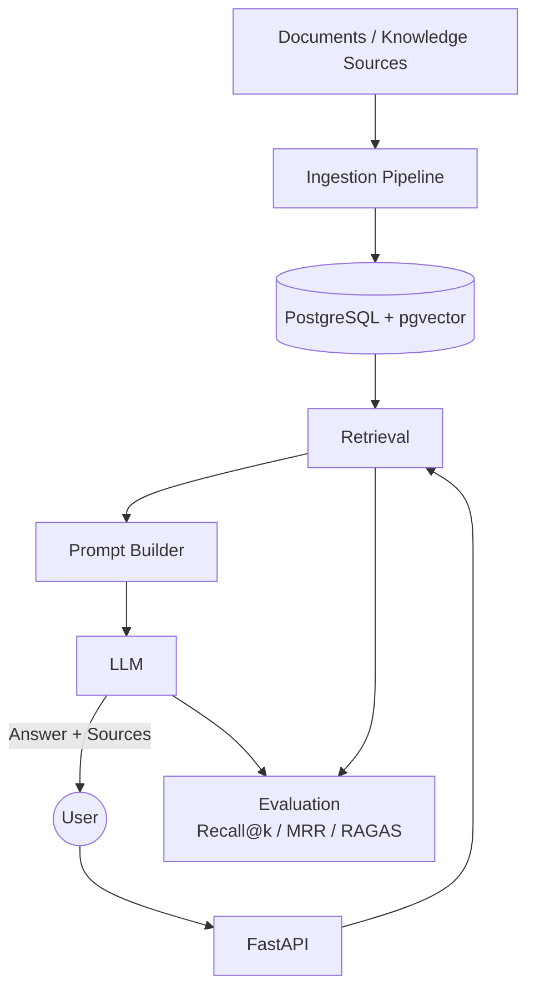

# local-rag-system

[](https://github.com/ajits-github/local-rag-system/actions/workflows/ci.yml)

A modular, config-driven local RAG system: sentence-transformers embeddings,
Postgres+pgvector storage, Ollama generation, FastAPI serving. Every infra
choice (embedding model, vector backend, chunker, reranker, LLM) is
swappable via `config/default.yaml`: nothing is hardcoded, so comparative
experiments can change one axis without touching pipeline code. Runs fully
offline on a CPU-only, 8GB-RAM machine; no API keys required by default.

See [`CLAUDE.md`](CLAUDE.md) for the architecture map and module conventions.

## Architecture



For the detailed system view, see [`docs/architecture.md`](docs/architecture.md).

| Component | Current implementation | Configurable / future |
|---|---|---|
| Embeddings | all-MiniLM-L6-v2 | swappable |
| Vector DB | PostgreSQL + pgvector | swappable |
| Chunker | structured Markdown | swappable |
| Retrieval | dense vector search | hybrid retrieval |
| Reranker | optional cross-encoder | Cohere / none |
| LLM | Qwen2.5 via Ollama | swappable |
| Prompt | versioned YAML templates | v1 / v2 |
| Evaluation | Recall@k, MRR, RAGAS | extensible |

## Prerequisites

- Python 3.11+
- [Docker](https://www.docker.com/) (for the Postgres+pgvector container)
- [Ollama](https://ollama.com/) installed, **running**, and with
  `qwen2.5:1.5b` pulled:
  ```
  ollama pull qwen2.5:1.5b
  ```
  Ollama usually starts automatically after install; verify it's actually
  serving with `ollama list` (or `curl http://localhost:11434/api/version`).
  If it's installed but not on your PATH, invoke it by its full path (e.g.
  on Windows: `C:\Users\<you>\AppData\Local\Programs\Ollama\ollama.exe`).
- **`make`**: used for the `up`/`ingest`/`query`/`test` shortcuts below.
  **Not installed by default on Windows** (neither Git Bash nor PowerShell
  ship it). Install it via `choco install make`, `scoop install make`, or
  WSL, *or* skip it entirely and run the underlying command shown next to
  each `make` target below; every target is a one-liner.

## Setup

1. Create a virtualenv and install the project:
   ```
   python -m venv .venv
   .venv/Scripts/activate        # Windows
   pip install -e ".[dev]"
   ```
2. Copy `.env.example` to `.env` and adjust if needed. `DATABASE_URL` points
   at Postgres on **host port 15987** (not the default 5432) so it won't
   collide with any other local Postgres instance:
   ```
   cp .env.example .env
   ```
   Already have a Postgres+pgvector container running locally? Point
   `DATABASE_URL` at it directly instead of step 3's `docker-compose.yml`
   (match `POSTGRES_DB` to its real name), then still run
   `python scripts/init_db.py` (idempotent) to create/migrate the schema.
3. Bring up Postgres+pgvector and initialize the schema:
   ```
   make up
   ```
   Without `make`, run the two steps it wraps:
   ```
   docker compose up -d
   python scripts/init_db.py
   ```
4. Ingest a knowledge base - any file or directory works, nothing is
   hardcoded. The bundled smoke-test set:
   ```
   make ingest FILE=data/sample_docs
   ```
   Without `make`:
   ```
   python -m rag.ingestion.pipeline data/sample_docs
   ```
   This repo doesn't ship a large real-world knowledge base. A larger one
   (internally called "TechFusion") was used against this pipeline during
   development, with a folder-per-category layout (`engineering/`,
   `security/`, `hr/`, etc.) preserved as filterable `category` metadata,
   but neither it nor its gold eval set are committed here. Point the same
   ingestion command at your own directory to reproduce that; the path is
   always a CLI argument, never hardcoded.

   Re-running ingestion on unchanged files is a no-op (checksum-based, no
   duplicate chunks); edited files are detected and re-chunked in place
   under the same `document_id`.
5. Start the API:
   ```
   uvicorn rag.api.main:app --reload
   ```
   Then hit `GET /health`, `POST /ingest`, `POST /query`, or browse
   `/docs` / `/redoc`.
6. Query via the Makefile once the API is running:
   ```
   make query Q="What are the deployment windows for production releases?"
   ```
   Without `make`:
   ```
   curl -s -X POST http://localhost:8000/query -H "Content-Type: application/json" -d '{"query": "What are the deployment windows for production releases?"}'
   ```
   Filter retrieval by the `category` metadata preserved from folder
   structure; only meaningful once you've ingested a dataset with
   subfolders (`data/sample_docs/` is flat, so this is illustrative rather
   than directly runnable against it):
   ```
   curl -s -X POST http://localhost:8000/query -H "Content-Type: application/json" \
     -d '{"query": "What MFA methods are approved?", "filters": {"category": "security"}}'
   ```

## Containerized development

Postgres+pgvector and the API can both run in containers; Ollama stays
native on Windows. `docker-compose.yml` builds `rag-api` from the repo's
multi-stage `Dockerfile` (no `tests`/`scripts`/`data`/optional extras in
the final image; runs as non-root) and wires it to `postgres` and to the
host's Ollama via `host.docker.internal`. Requires **Docker Compose V2**.

```
docker compose up -d --build          # first build pulls ~1-2GB of ML deps (PyTorch); later ones are cached
python scripts/init_db.py             # against the containerized Postgres, via DATABASE_URL in .env
curl http://localhost:8000/health     # {"vectorstore":"ok","llm":"ok"} confirms it reached both deps
scripts/smoke_test_containers.sh      # full ingest -> query round trip, one shot
docker compose down                   # add -v to also drop the pgdata volume
```
Ingest/query work exactly as in native dev, same port/endpoints. `src/`
and `config/` are bind-mounted with `--reload`, so Python edits need no
rebuild — only `pyproject.toml` changes do.

**Production-shaped run**: `docker-compose.prod.yml` drops the bind
mounts and `--reload`, stops publishing Postgres's port, and tightens
health-check timing (same-host "productionized," not a Kubernetes
substitute — see [Roadmap](#roadmap)):
```
docker compose -f docker-compose.yml -f docker-compose.prod.yml up -d --build
```

### Windows-specific notes

- `host.docker.internal` (used to reach native Ollama) is a Docker Desktop
  feature; `docker-compose.yml` also adds `extra_hosts:
  host.docker.internal:host-gateway` so it resolves on native Linux too.
- Docker Desktop's Windows file sharing doesn't enforce host-side POSIX
  permissions, so the non-root `rag` user can read/write the bind-mounted
  volumes without any `chown`/`chmod` step (native Linux would need the
  container UID to match the host user's).
- The embedding model downloads from Hugging Face Hub on first use inside
  a fresh container/volume if not already cached — needs outbound internet
  that one time, same as native.

## Configuration

All provider choices and tunables live in `config/default.yaml`:
embedding model, chunk size/overlap, reranker (`none` / `cross_encoder` /
`cohere`), LLM, retrieval `top_k`. Point at an alternate config with
`--config path/to/other.yaml` on the ingestion/eval CLIs, or by editing the
default file directly for local experiments.

Generation prompts are versioned YAML files under
`src/rag/prompts/templates/` (`rag_answer_v1.yaml`, `rag_answer_v2.yaml`,
...), loaded and validated by `src/rag/prompts/loader.py`. The active
version is selected by `config/default.yaml`'s `generation.prompt` block
(`id`, `version`, `path`); `RetrievalPipeline` loads it once at
construction and rejects the file if its own declared `prompt_id`/`version`
don't match what's configured. `rag_answer_v2.yaml` ships as an example of
a stricter grounding/citation prompt but isn't active by default.

## Metadata & filtering

Every chunk carries: `document_id, chunk_id, source, source_type, title,
author, url, created_at, last_modified, language, category`. For Markdown
sources with a YAML front-matter block (`title`/`owner`/`last_reviewed`,
the convention used by the private TechFusion knowledge base mentioned
above), `title`/`author`/`last_modified` are parsed from it rather than
falling back to the filename/filesystem timestamp, and the front-matter
block itself is stripped before chunking.
`category` is the file's folder path relative to whatever root you ingested
(e.g. `security`, or `security/subteam` for nested folders); `None` for a
single ingested file or an API upload, which have no folder context.
`POST /query`'s `filters` field can restrict retrieval by any of
`document_id, source, source_type, title, author, url, language, category`
(see the `curl` example above).

## Evaluation

A gold file is a JSONL file, one labeled question per line:
`question, expected_answer, relevant_documents, question_type, difficulty,
unanswerable`. `relevant_documents` are paths *relative to wherever the
knowledge base root is* (e.g. `"knowledge_base/security/access-control-policy.md"`)
rather than `document_id`s, since ids are only assigned at ingestion time.
Matching a retrieved chunk's stored `source` against these paths is done by
path-suffix, not exact equality or a hardcoded root, so the same gold file
and the same `run_eval` command work regardless of what directory you
actually ingested from.

`data/eval/sample_gold.jsonl` is a tiny smoke-test gold file bundled with
this repo, matching `data/sample_docs/`. A much larger gold set
(`question_type`s `single_document`/`multi_hop`, plus unanswerable and
multimodal questions) was used against the private TechFusion knowledge
base during development; it isn't committed here either. Point `--gold`
at your own to reproduce that kind of evaluation.

```
python -m rag.eval.run_eval --gold data/eval/sample_gold.jsonl --dataset-id sample_docs
```
`--dataset-id` is mandatory, it's injected as a filter on every retrieval
the runner makes, so an evaluation can never silently score chunks from a
different dataset. Point `--gold`/`--dataset-id` at any gold file and
dataset; nothing about the runner is tied to a particular one. Reports,
for the configured pipeline:
- **Recall@5 / Recall@10** and **Hit Rate@5 / Hit Rate@10**: recall
  averages the fraction of *all* relevant documents found per question;
  hit rate is binary (was *any* relevant document found), so the two
  diverge on multi-document questions.
- **MRR** (mean reciprocal rank).
- **Retrieval / generation / total latency** (mean, ms), measured from the
  pipeline's actual configured `rerank_top_n` (not the broader top-10 fetch
  used for the Recall@10 calculation above, which would otherwise inflate
  the latency number).
- **Answer quality**: a keyword-overlap heuristic scored against
  `expected_answer` (see the caveat in its own output; it's a placeholder,
  not a correctness judge — see the RAGAS section below for the real one).

Add `--verbose` to include full per-question detail (retrieved sources,
generated answer, individual scores) in the JSON output, or
`--skip-generation` to get only the retrieval metrics quickly, without
waiting on LLM calls for every question.

### RAGAS generation-quality evaluation (optional)

An opt-in, additive layer on top of the metrics above: faithfulness,
answer relevancy, context precision, context recall, and (if supported
cleanly by the installed RAGAS version) answer correctness — each scored
by an independently-configured LLM judge, not by `qwen2.5:1.5b`/`3b` (the
models already used for generation). Install with:
```
pip install .[ragas]         # local (ollama) judge
pip install .[ragas,anthropic]  # + hosted anthropic judge
```
The judge is selected via `config/default.yaml`'s `judge:` block
(`provider: openai | anthropic | ollama`, each with its own model/API-key
settings, resolved from `*_env_var` environment variables — never
hardcoded). `ollama` is offered for free local experimentation only; the
docs and RAGAS's own guidance both note small local judges give less
reliable scores than a hosted model.

```
python -m rag.eval.run_ragas_eval --gold data/eval/sample_gold.jsonl \
    --dataset-id sample_docs --verbose > /tmp/ragas_report.json
```
`--sample-size` (default **15**) caps how many gold questions get judged —
validate cost, latency, and score quality on a small subset before scaling
up to a full gold set. The report records per-question and aggregate
scores, judge provider/model and estimated API usage, `prompt_id`/
`prompt_version`, and the RAG config that produced it — feed it into
`scripts/record_experiment.py` exactly like a normal `run_eval.py` report.

Judge calls are cached to disk by default (`config.judge.cache_enabled:
true`, `cache_dir: .cache/ragas` — gitignored, never commit cached judge
responses), so re-running an unchanged eval doesn't re-pay for identical
verdicts. The cache key is namespaced by judge provider/model/temperature/
max_tokens (not just the rendered prompt) so switching judges always
misses instead of silently replaying another model's cached score — see
`rag/eval/ragas_cache.py`. The report's `ragas.cache` key shows
`hits`/`misses`/`total` and an `avoided_cost_estimate` (extrapolated from
that run's own uncached-call token usage; reports a `reason` instead of a
number it can't back up, e.g. an unpriced model). Set
`judge.cache_enabled: false` to disable.

**RAGAS scores are not validated until reviewed against real human
judgment.** Two scripts help with that:
```
python scripts/generate_manual_review.py --eval-output /tmp/ragas_report.json --num-rows 10
# ... fill in the human_faithful/human_correct/human_relevant/human_correct_refusal
# fields in the generated JSONL by hand ...
python scripts/compare_ragas_manual.py --ragas-output /tmp/ragas_report.json \
    --manual-review data/eval/manual_review/sample_docs_manual_review.jsonl
```
The comparison report shows where the judge agrees or disagrees with the
human labels — do not treat RAGAS scores as ground truth until you've run
this and reviewed the result yourself.

## Benchmarks

`experiments/` tracks comparable eval runs over time: `configs/` holds a
snapshot of `config/default.yaml` per experiment, `results/` holds a flat
JSON metrics record per experiment (schema below), and `reports/` holds
the generated comparison table. Only aggregate metrics and config values
are stored here, never corpus content or generated answers, so all three
are safe to commit even though the underlying dataset isn't (per dataset
above).

The table below is generated, not hand-written; don't edit it directly,
regenerate it instead (see "Recording a new experiment").

<!-- EXPERIMENTS_TABLE_START -->
| # | Label | Retrieval | Generation model | Embedder | Reranker | Prompt | Rel.Exp | Recall@5 | Recall@10 | Hit Rate@10 | MRR | Answer quality | Supp.Ctx Hit | Img Hit | RAGAS Faithful | RAGAS Correct | Total latency | Dataset | Date |
|---|---|---|---|---|---|---|---|---|---|---|---|---|---|---|---|---|---|---|---|
| 1 | TechFusion baseline (qwen2.5:1.5b, no reranker) | dense | qwen2.5:1.5b | all-MiniLM-L6-v2 | none | - | - | 0.891 | 0.967 | 0.978 | 0.847 | 0.432 | - | - | - | - | 3.7s | techfusion | 2026-08-05 |
| 2 | qwen2.5:3b (candidate generation model) | dense | qwen2.5:3b | all-MiniLM-L6-v2 | none | - | - | 0.891 | 0.967 | 0.978 | 0.847 | 0.453 | - | - | - | - | 12.1s | techfusion | 2026-08-05 |
| 3 | qwen2.5:3b + cross_encoder reranker | dense | qwen2.5:3b | all-MiniLM-L6-v2 | cross_encoder (ms-marco-MiniLM-L-6-v2) | - | - | 0.891 | 0.967 | 0.978 | 0.822 | 0.507 | - | - | - | - | 10.1s | techfusion | 2026-08-05 |
| 4 | qwen2.5:3b + cross_encoder + BGE-small embedder | dense | qwen2.5:3b | bge-small-en-v1.5 | cross_encoder (ms-marco-MiniLM-L-6-v2) | - | - | 0.902 | 0.935 | 0.957 | 0.825 | 0.483 | - | - | - | - | 10.3s | techfusion-bge-small | 2026-08-05 |
| 5 | qwen2.5:3b + cross_encoder + BGE-small + chunk_size=300 | dense | qwen2.5:3b | bge-small-en-v1.5 | cross_encoder (ms-marco-MiniLM-L-6-v2) | - | - | 0.902 | 0.946 | 0.957 | 0.808 | 0.427 | - | - | - | - | 9.9s | techfusion-bge-small-chunk300 | 2026-08-05 |
| 6 | structured_markdown chunker (62-question gold set, tables/code/config/chart) | dense | qwen2.5:1.5b | all-MiniLM-L6-v2 | none | v1 | - | 0.919 | 0.952 | 0.968 | 0.865 | 0.387 | - | - | - | - | 2.8s | techfusion | 2026-08-06 |
| 7 | RAGAS pilot (OpenAI gpt-4o-mini judge, 15-question stratified sample) | dense | qwen2.5:1.5b | all-MiniLM-L6-v2 | none | v1 | - | 1.000 | 1.000 | 1.000 | 0.906 | 0.348 | - | - | 0.844 | 0.471 | 3.0s | techfusion | 2026-08-06 |
| 8 | RAGAS full evaluation (OpenAI gpt-4o-mini judge, all 62 questions) | dense | qwen2.5:1.5b | all-MiniLM-L6-v2 | none | v1 | - | 0.919 | 0.952 | 0.968 | 0.865 | 0.413 | - | - | 0.786 | 0.469 | 4.4s | techfusion | 2026-08-06 |
| 9 | hybrid retrieval (BM25+dense, RRF k=60) pilot vs. experiment_007 dense baseline | hybrid | qwen2.5:1.5b | all-MiniLM-L6-v2 | none | v1 | - | 0.900 | 1.000 | 1.000 | 0.822 | 0.378 | - | - | 0.820 | 0.591 | 3.0s | techfusion | 2026-08-06 |
| 10 | hybrid retrieval (BM25+dense, RRF k=60, punctuation-aware tokenizer) full 62-question vs. experiment_008 dense baseline | hybrid | qwen2.5:1.5b | all-MiniLM-L6-v2 | none | v1 | - | 0.903 | 0.944 | 0.952 | 0.865 | 0.391 | - | - | 0.841 | 0.504 | 2.1s | techfusion | 2026-08-07 |
| 11 | Multimodal milestone Experiment A: prompt v2, hybrid+RRF (matches experiment_010), text-only image handling, relationship expansion OFF, hosted vision OFF | hybrid | qwen2.5:1.5b | all-MiniLM-L6-v2 | none | v2 | off | 0.911 | 0.946 | 0.952 | 0.824 | 0.413 | 0.697 | 0.579 | - | - | 5.2s | techfusion | 2026-08-11 |
| 12 | Multimodal milestone Experiment B: identical to experiment_011 except relationship expansion ON (parent+neighbors, max 3) | hybrid | qwen2.5:1.5b | all-MiniLM-L6-v2 | none | v2 | on | 0.911 | 0.946 | 0.952 | 0.824 | 0.418 | 0.788 | 0.842 | - | - | 13.7s | techfusion | 2026-08-11 |
| 13 | prompt v2 + relationship expansion + RAGAS (15-q stratified sample) | hybrid | qwen2.5:1.5b | all-MiniLM-L6-v2 | none | v2 | on | 0.800 | 0.867 | 0.867 | 0.697 | 0.328 | 0.625 | 0.875 | 0.700 | 0.409 | 7.4s | techfusion | 2026-08-12 |
| 14 | qwen2.5:3b generation model (vs experiment_012's qwen2.5:1.5b), full 84 questions, prompt v2 + relationship expansion | hybrid | qwen2.5:3b | all-MiniLM-L6-v2 | none | v2 | on | 0.911 | 0.946 | 0.952 | 0.824 | 0.452 | 0.788 | 0.842 | - | - | 19.2s | techfusion | 2026-08-12 |
| 15 | Biggest config: qwen2.5:3b + prompt v2 + hybrid+relationship expansion + RAGAS, full 84 questions | hybrid | qwen2.5:3b | all-MiniLM-L6-v2 | none | v2 | on | 0.911 | 0.946 | 0.952 | 0.824 | 0.442 | 0.788 | 0.842 | 0.898 | 0.513 | 18.4s | techfusion | 2026-08-12 |
| 16 | cutoff-semantics refactor baseline (qwen2.5:3b, hybrid+RRF, rel-exp on, reranker=none) | hybrid | qwen2.5:3b | all-MiniLM-L6-v2 | none | v2 | on | 0.911 | 0.946 | 0.952 | 0.824 | 0.440 | 0.788 | 0.842 | - | - | 24.3s | techfusion | 2026-08-13 |
| 17 | cross-encoder reranker vs no-reranker baseline (qwen2.5:3b, hybrid+RRF, rel-exp on) | hybrid | qwen2.5:3b | all-MiniLM-L6-v2 | cross_encoder (ms-marco-MiniLM-L-6-v2) | v2 | on | 0.929 | 0.940 | 0.940 | 0.826 | 0.453 | 0.803 | 0.842 | - | - | 24.3s | techfusion | 2026-08-13 |
| 18 | context/latency A: qwen3b ctx3 tok512 (rel-exp best config) | hybrid | qwen2.5:3b | all-MiniLM-L6-v2 | none | v2 | on | 0.911 | 0.946 | 0.952 | 0.824 | 0.437 | 0.788 | 0.842 | - | - | 25.5s | techfusion | 2026-08-14 |
| 19 | context/latency B: qwen3b ctx2 tok512 | hybrid | qwen2.5:3b | all-MiniLM-L6-v2 | none | v2 | on | 0.911 | 0.946 | 0.952 | 0.824 | 0.415 | 0.788 | 0.842 | - | - | 33.5s | techfusion | 2026-08-14 |
| 20 | context/latency C: qwen3b ctx2 tok256 | hybrid | qwen2.5:3b | all-MiniLM-L6-v2 | none | v2 | on | 0.911 | 0.946 | 0.952 | 0.824 | 0.427 | 0.788 | 0.842 | - | - | 6.3s | techfusion | 2026-08-14 |
| 21 | context/latency A RAGAS (15q sample): qwen3b ctx3 tok512 | hybrid | qwen2.5:3b | all-MiniLM-L6-v2 | none | v2 | on | 0.800 | 0.867 | 0.867 | 0.697 | 0.304 | 0.625 | 0.875 | 0.868 | 0.320 | 14.8s | techfusion | 2026-08-14 |
| 22 | context/latency B RAGAS (15q sample): qwen3b ctx2 tok512 | hybrid | qwen2.5:3b | all-MiniLM-L6-v2 | none | v2 | on | 0.800 | 0.867 | 0.867 | 0.697 | 0.374 | 0.625 | 0.875 | 0.833 | 0.339 | 15.4s | techfusion | 2026-08-14 |
| 23 | context/latency C RAGAS (15q sample): qwen3b ctx2 tok256 | hybrid | qwen2.5:3b | all-MiniLM-L6-v2 | none | v2 | on | 0.800 | 0.867 | 0.867 | 0.697 | 0.374 | 0.625 | 0.875 | 0.905 | 0.302 | 9.0s | techfusion | 2026-08-14 |
| 24 | classic_rag_baseline_v1 | hybrid | qwen2.5:3b | all-MiniLM-L6-v2 | none | v2 | on | 0.911 | 0.946 | 0.952 | 0.824 | 0.448 | 0.788 | 0.842 | 0.902 | 0.503 | 24.9s | techfusion | 2026-08-14 |
<!-- EXPERIMENTS_TABLE_END -->

*Total latency is the mean of retrieval+generation per question, at the
config's production `rerank_top_n` (not the broader top-10 fetch used for
Recall@10). Every row measured against `dataset_id`-isolated retrieval
(see Metadata & filtering above), so results are never contaminated by a
different dataset in the same vector store.*

**Experiments 11-15** are the multimodal/relationship-aware milestone:
11-12 isolate relationship expansion (identical Recall/MRR, higher
`Supp.Ctx Hit`/`Img Hit`, ~2.6x latency); 13 adds RAGAS scoring on a
stratified 15-question sample (not directly comparable to 11/12/14/15's
full-84-question numbers); 14 swaps the generation model
(`qwen2.5:1.5b` -> `qwen2.5:3b`) on top of 12's config; 15 is #14's config
(the best found so far) RAGAS-scored against the **full 84-question gold
set**, not a sample. Faithfulness (0.898) and answer_correctness (0.513)
are the highest recorded for this project. Total hosted judge cost across
13+15: **$0.2684** (13: $0.0399; 15: $0.2285, from tracked usage — 1,431
calls, 1,115,731 input / 101,857 output tokens on `gpt-4o-mini`). Full
analysis, per-question findings, and a correction to one of 13's original
claims are in [`docs/architecture.md`](docs/architecture.md) and
`PROJECT_JOURNAL.md`.

### Recording a new experiment

1. Change one thing in `config/default.yaml` (reranker, model, chunk size,
   prompt version, ...).
2. Run the eval and save its full report (or `rag.eval.run_ragas_eval` for
   the RAGAS-scored variant, see above):
   ```
   python -m rag.eval.run_eval --gold data/eval/techfusion_gold.jsonl \
     --dataset-id techfusion --verbose > /tmp/eval_report.json
   ```
3. Register it as an experiment (never re-runs eval, just records the
   report above):
   ```
   python scripts/record_experiment.py --eval-output /tmp/eval_report.json \
     --experiment-id experiment_002 --label "cross-encoder reranker" \
     --config config/default.yaml
   ```
   Captures every config axis (embedding model, chunk size, reranker,
   prompt version + checksum, and RAGAS scores if present) and also logs
   an MLflow run (see "MLflow tracking" below), unless `mlflow.enabled:
   false`.
4. Regenerate the comparison table (updates
   `experiments/reports/comparison.md` and this README section in place):
   ```
   python scripts/compare_experiments.py
   ```
   Pass `--exclude experiment_id[,experiment_id...]` to leave a
   non-comparable record (e.g. a small pilot run at a different sample
   size) out of the table.

### MLflow tracking

Every `scripts/record_experiment.py` call also logs an MLflow run (config
as params, metrics, and the eval-output/record/config files as artifacts),
under a readable run name like `experiment_015_qwen2-5-3b_v2_hybrid_rel-exp`
(display-only — the real MLflow run UUID is unaffected) and tagged with
`experiment_id`/`label`/`generation_model`/`prompt_version`/
`retrieval_provider`/`reranker_provider`/`relationship_expansion`/
`dataset_id` for fast filtering in the MLflow UI. Requires the `mlflow`
extra (`pip install .[mlflow]`) — fails loudly rather than silently
skipping if enabled but not installed. Local by default, no server
required (`mlflow.tracking_uri: sqlite:///mlflow.db`):
```
mlflow ui --backend-store-uri sqlite:///mlflow.db
```
`scripts/backfill_mlflow.py` re-logs every `experiments/results/*.json`
into MLflow in one pass, useful if `mlflow.db`/`mlruns/` is ever deleted.

## Testing

```
make test
```
Without `make`: `pytest tests/ -v`.

Unit tests (`tests/unit`) mock all external I/O and always run. Integration
tests (`tests/integration`) assume Postgres (`make up`) and a local Ollama
with `qwen2.5:1.5b` are already running, and skip with a clear message if
either is unreachable.

`scripts/smoke_test_containers.sh` is a separate check for the
containerized setup specifically: it assumes `docker compose up -d` (or
the prod-override form) is already running, and proves the *containerized*
API can reach Postgres+pgvector and native Ollama, then does a real
ingest -> query round trip against them (see
[Containerized development](#containerized-development) above).

## Continuous Integration

`.github/workflows/ci.yml` runs on every PR/push to `main` (and via manual
`workflow_dispatch`), in four parallel jobs:

- **code-quality** — `pre-commit run --all-files` (ruff, ruff-format, mypy,
  hygiene hooks — the same checks `pre-commit install` runs locally).
- **unit-tests** — the full `tests/unit` suite; no external services.
- **integration-tests** — `tests/integration` against a `pgvector/pgvector:pg16`
  service container spun up by the workflow itself (not your local `make up`
  stack). Tests gated on a local Ollama (`require_ollama` in
  `tests/integration/conftest.py`) skip cleanly, since CI doesn't run Ollama.
- **docker-build** — builds the production image from `Dockerfile`, runs it
  against the same Postgres service container, and checks `GET /health`
  reports `vectorstore: ok` (Ollama is expected `unreachable` here, for the
  same reason as above). No image is pushed anywhere yet.

What CI intentionally leaves out: RAGAS scoring, hosted-judge (OpenAI/
Anthropic) calls, MLflow experiment logging, and the full TechFusion
evaluation — all of these need either a local Ollama, hosted API keys, or
minutes-long LLM calls that don't belong in per-PR feedback. They stay
manual, run locally via `scripts/record_experiment.py` /
`eval/run_ragas_eval.py` as today.

## Roadmap

Deferred for now, tracked here rather than left as empty scaffolding:

- **Cross Encoder**: mature the scaffolded `cross_encoder` reranker
  (`rerankers/cross_encoder.py`) with real benchmarking/tuning.
- **Cohere Reranking**: mature the scaffolded optional `cohere` provider
  (`rerankers/cohere.py`) once there's a use case needing a hosted reranker.
- **RAGAS trust**: judge-vs-human agreement has been spot-checked
  (`scripts/compare_ragas_manual.py`) on several samples, but scores still
  aren't validated against human labels by default — see the caveat in
  every RAGAS report.
- **LangGraph**: move retrieval/generation orchestration to a graph for
  multi-step or agentic query handling.
- **MCP**: expose ingest/query as MCP tools for use from other agents.
- **Multi-agent workflows**: e.g. a query-planning agent in front of
  retrieval, or specialized agents per document source.
- **Kubernetes deployment**: containerize the API and vector store for a
  non-local deployment target.
- **Observability**: OpenTelemetry tracing/metrics on top of the current
  structured JSON logging.
