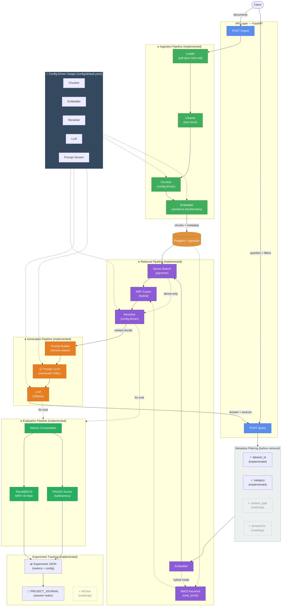

# Detailed Architecture

This is the expanded system view for implementation details, experiments,
and planned extension points. The README keeps a smaller public-facing view.



**Pipeline Flow:**
1. **Ingestion**: Files -> Loader -> Cleaner -> Chunker -> Embedder -> Database
2. **Retrieval**: Question -> Metadata Filter -> Embedder -> Dense/BM25 Search -> RRF Fusion -> Reranker -> Results
3. **Generation**: Results -> Prompt Builder (v1/v2) -> LLM -> Answer
4. **Evaluation**: Retrieval & generation -> Metrics (Recall, MRR, RAGAS) -> Experiment Record -> PROJECT_JOURNAL

**Legend:**
- ✓ = Implemented (solid lines/colors)
- ◐ = Roadmap (dashed borders)
- 🔧 = Config-driven swaps (every colored box is selectable via `config/default.yaml`)
- Dashed arrows = conditional paths (hybrid mode, dense-only mode) or evaluation flow

## Multimodal + Relationship-Aware Ingestion

Extends the ingestion/retrieval pipelines above to treat images as
first-class searchable elements and to preserve (and, at retrieval time,
optionally re-surface) structural relationships a flat chunk stream would
otherwise lose -- image → caption, table/code/image → parent section,
element → neighbor. Reuses the existing `Chunk`/`ChunkMetadata` model and
the existing chart-fence-plus-caption pattern rather than introducing a
parallel document-element schema or a graph database.

### Element model: images as a first-class `content_type`

`StructuredMarkdownChunker` already treated fenced code/config blocks and
tables as atomic, priority-ordered blocks ahead of size-based prose
splitting. A standalone `` markdown image line (on its own
line, pointing at a real asset extension -- not an inline link embedded
mid-paragraph) is now recognized the same way: it flushes pending prose
and becomes its own span with `content_type="image"`. An immediately
following, emphasis-wrapped paragraph (`*Figure 1: ...*`) is folded into
that same span's `text` -- mirroring the chart-fence-plus-caption pattern
that already existed for ` ```text ` fences -- rather than being modeled as
an independent "caption" element. This is a deliberate simplification: an
image and its caption are always retrieved and expanded together as one
unit, at the cost of a caption never being independently addressable.

An image link embedded *inline* within an ordinary prose paragraph (not
alone on its own line) is unaffected -- it's still just attachment tagging
on whichever prose sub-chunk contains it, as before.

### Relationship linkage: `parent_chunk_id`

Two new nullable columns on `chunks` (idempotent `ALTER TABLE ... ADD
COLUMN IF NOT EXISTS`, no forced recreation): `parent_chunk_id TEXT` and a
pair for vision provenance (`vision_generated BOOLEAN`,
`vision_description TEXT`).

`parent_chunk_id` is computed in `Writer.write`'s existing single pass over
a document's chunk spans (no new pipeline stage, no extra DB round-trip):
a non-prose span (table/code/configuration/chart/image) links to the id of
the most recently seen **prose** span sharing its `section_path` -- the
paragraph that introduces that section, standing in for "surrounding
explanation" without building a full parse tree. Prose spans themselves
get `parent_chunk_id=None`: reconstructing a section's full prose is
already just "same `document_id` + `section_path`, ordered by
`chunk_index`" (see `VectorStore.get_chunks_by_section`), so no pointer
chain is needed there. A non-prose span with no preceding prose in its
section (a table/image opening a section) also gets `None`. This is a
heuristic, not a guarantee for every possible document shape -- but it
matches every real TechFusion knowledge-base document checked.

No foreign-key constraint on `parent_chunk_id`: parent and child rows for
one document land in the same `execute_values` insert batch, and
`delete_chunks_by_document_id` always removes a document's chunks as a
unit, so a self-referential FK's insert-ordering fragility isn't worth
taking on for a guarantee that already holds in practice.

### Image handling: text-only vs. vision

Two modes, selected by `config.vision.provider`:

- **`"none"` (the default, and the only mode exercised so far).** No image
  bytes are ever read; the image's indexable content is exactly its
  markdown alt text plus any folded-in caption. Requires no model beyond
  what already runs on an 8GB box.
- **A hosted vision provider (scaffolded, not yet implemented).**
  `config.vision`, `factory.build_vision_provider`, and
  `Writer._with_vision_siblings` are wired end-to-end, but no concrete
  network-calling `VisionProvider` subclass has been written yet -- no
  provider/model has been chosen, and nothing in this milestone's
  Experiment A/B needs it. When enabled, ingestion resolves each image
  span's `source_anchor` to a real file, checks a Postgres-backed
  `image_description_cache` (keyed by the image's own sha256 checksum, so
  an unchanged image is never reprocessed across documents or ingestion
  runs), calls `VisionProvider.describe_image` only on a cache miss, and
  adds a **second, sibling chunk** (`vision_generated=True`,
  `vision_description=<text>`, same `attachment_name`/`source_anchor`/
  `section_path`/`parent_chunk_id` as its caption-only sibling) --
  never overwriting the original caption/alt-text chunk. `VisionProvider`
  itself (`vision/base.py`) now declares `provider_name`/`model_name`
  abstract properties (for cache provenance) alongside `describe_image`.

No hosted vision API call has been made as part of this milestone. Tests
use a local mock `VisionProvider` subclass only.

### Relationship-aware context expansion

`config.retrieval.relationship_expansion` (`enabled: false` by default --
a no-op unless explicitly turned on) adds a post-rerank step in
`RetrievalPipeline.retrieve()`. Ranking and expansion stay separate by
design: for each already-ranked result, candidate related chunks (its
`parent_chunk_id`, and/or its immediate previous/next chunk by
`chunk_index` within the same section, via two new plain-SQL
`VectorStore` methods -- `get_chunks_by_ids`, `get_chunks_by_section`) are
**appended after** the ranked list, not interleaved into it, tagged
`origin="expanded"` / `expanded_from=<originating chunk id>` on
`SearchResult` (a new field, default `"retrieved"`). An expanded result's
`.score` is inherited from its originating result rather than
freshly computed -- `origin` is the field callers should check, not
`.score`. Deduplicated against chunks already present in the retrieved set
and across expansions of different results; capped at
`max_related_elements` additions per originating result.

Because every expansion lookup is scoped to the originating chunk's own
`document_id` (never shared across datasets -- see "Document identity"
above), expansion cannot cross a `dataset_id` boundary by construction,
not by an added runtime check.

`RetrievalPipeline`'s prompt-building (`_source_label`) was extended to
label each context passage with its section, `content_type`, and -- for
an image chunk -- whether its text is caption/alt-text-only or a
vision-generated description, plus whether it was relationship-expanded.
This exists so the model is never handed grounds to imply it visually
inspected an image when only caption/alt-text was available, and so a
human reviewing a transcript can immediately tell directly-retrieved
context from expanded context.

### Evaluation ground truth: `reference_contexts` / `reference_visual_contexts`

`GoldExample` (`eval/gold_schema.py`) gained six optional, defaulted
fields -- `content_type`, `reference_contexts`, `reference_visual_contexts`,
`relevant_images`, `relevant_sections`, `requires_vision`,
`requires_relationship_expansion` -- so older gold files without them
(`techfusion_gold_old.jsonl`, `sample_gold.jsonl`) still parse unchanged.

`reference_contexts` is textual ground truth, authored as a **verbatim
excerpt** from the source corpus (confirmed against the real gold file:
exact JSON blocks, exact backtick commands, exact caption sentences
including their `*asterisks*`) -- never a paraphrase of `expected_answer`.
`reference_visual_contexts` is evaluation-only ground truth for facts
visually present in an image but intentionally absent from its indexed
text (e.g. an exact chart value). **Both are read exclusively by
`eval/*.py`** -- `ingestion`, `retrieval`, and `generation` modules never
import `rag.eval`, and gold data is never written into the `chunks` table.
A static test (`test_gold_data_isolation.py`) asserts the import boundary
directly; a runtime test proves a marker string placed in
`reference_visual_contexts` never appears in a generated prompt.

`reference_context_is_supported` (`eval/gold_schema.py`) is the shared
matching primitive: a whitespace/case-normalized substring check, used by
both `scripts/validate_gold_file.py` (does each `reference_contexts` entry
resolve somewhere in its `relevant_documents`' **raw** file text -- raw,
not loader-parsed, because a reference can legitimately come from YAML
front-matter that `TextLoader` strips before chunking) and
`eval/run_eval.py`'s new metrics below. Documented limitation: this proves
"this text exists somewhere in the source," not that it's the *correct*
supporting passage, and it's brittle to formatting drift the gold author's
copy-paste might introduce (e.g. a reference spanning a table row-group
chunk boundary) -- an under-count, not an over-count, risk.

### New deterministic metrics (`eval/run_eval.py`)

All computed from the same broad top-10 retrieval already made for
Recall@10 -- no extra retrieval calls, and fully deterministic (no LLM/
embedding-similarity involved):

- **`content_type_breakdown`**: Recall@5/@10/hit-rate@5 grouped by the
  gold file's own *authored* `content_type` (image_only, text_plus_image,
  caption_answerable, relationship_aware, ...; `"uncategorized"` for rows
  predating this field). Distinct from `eval/content_type.py`'s existing
  chunker-*derived* buckets (table/code_configuration/chart/prose), which
  is untouched and still backs `validate_gold_file.py`'s structural
  hard-fail check.
- **`reference_context_analysis`**: the A/B/C split -- A = relevant
  document retrieved AND `reference_contexts` found; B = document
  retrieved, supporting context missed; C = document missed entirely;
  `not_applicable` = no authored `reference_contexts` to check.
  `supporting_context_hit_rate = A / (A + B)`.
- **`relevant_image_hit_rate`**: for `relevant_images`-nonempty examples,
  whether any retrieved chunk's resolved asset path (`source_anchor`
  relative to its own document) matches -- meaningful in text-only mode
  too, since it only asks whether the right image *element* was surfaced.
- **`relationship_expansion_contribution_rate`**: among
  `requires_relationship_expansion=True` examples, the fraction where an
  `origin="expanded"` chunk supplied the supporting context that the
  pre-expansion set alone didn't -- proves expansion *contributed*
  evidence, not just that it fired. Necessarily `0.0` when
  `relationship_expansion.enabled=false`.
- **`vision_behavior_breakdown`** (generation runs only): for
  `requires_vision=True` examples in text-only mode, a heuristic
  categorical triage -- `correct_refusal` / `hallucinated_answer` /
  `caption_leak_success` / `incorrect_or_missing` -- via a small literal
  refusal-phrase matcher plus the existing `KeywordOverlapScorer`. A
  refused-but-genuinely-image-only question is expected, useful evidence,
  not automatically a bug; `caption_leak_success` covers both a
  legitimate caption-derived answer and an accidental leak identically,
  disambiguated only by cross-referencing the per-example `content_type`
  by hand.

### Controlled experiments (this milestone)

`config/experiments/multimodal-v2-text-only.yaml` (Experiment A) and
`multimodal-v2-relationship.yaml` (Experiment B) hold generation model
(`qwen2.5:1.5b`), embedder (`all-MiniLM-L6-v2`), chunker
(`structured_markdown`, 500/50), retrieval (`hybrid`, `rrf_k=60`,
reranker `none` -- matching `experiments/results/experiment_010.json`,
*not* `config/default.yaml`'s committed `dense`/`none`, a documented
discrepancy between the two), prompt `v2`, and `vision.provider=none`
fixed; only `retrieval.relationship_expansion.enabled` differs between
them. `config/default.yaml` itself is untouched by either file.

Recorded as `experiment_011` (A, expansion off) / `experiment_012` (B,
expansion on) — see README's Benchmarks table for the full row. Headline
result: Recall@5 (0.911), Recall@10 (0.946), and MRR (0.824) came out
**bit-for-bit identical** between A and B, direct proof expansion never
leaks into the ranked cutoff (it's appended after reranking, by design).
`supporting_context_hit_rate` rose 0.697 → 0.788 and
`relevant_image_hit_rate` rose 0.579 → 0.842 with expansion on, at
roughly 2.6x the total latency (5.2s → 13.7s/question — retrieval alone
went 212ms → 710ms from the extra lookups; the larger jump in generation
latency is most likely more appended source blocks lengthening the
Ollama prompt, not measured directly). Both runs made zero hosted API
calls. See `PROJECT_JOURNAL.md`'s 2026-08-11 entry for hand-inspected
concrete findings (including a documented false-negative gap in the
`vision_behavior_breakdown` heuristic, caught by reading actual model
answers rather than trusting the aggregate counts).

### RAGAS run on the multimodal gold set (experiment_013)

The first RAGAS run against the rewritten 84-question
`techfusion_gold.jsonl` (all prior RAGAS records — experiments 7/8 — judged
the older 46/62-question schema, pre-multimodal). Scored a **stratified
15-question sample**, `data/eval/techfusion_gold_v2_ragas_sample15.jsonl`,
built by `scripts/build_ragas_sample15.py` (deterministic, file-order
selection — not random): one question from each of the 9 authored
`content_type` buckets (`architecture_diagram`, `chart`, `table_image`,
`image_only`, `caption_answerable`, `relationship_aware`, `text_only`,
`text_plus_image`, `unanswerable_visual`), plus 6 from the plain/
uncategorized bucket spanning `question_type` (single_document/multi_hop),
`difficulty` (easy/medium/hard), and one `unanswerable=true` case — so the
sample represents both the multimodal edge cases and the 62/84-question
ordinary-retrieval majority. All fields pass through untouched from the
source gold file; the old `techfusion_gold_ragas_sample15.jsonl` (pre-
multimodal schema) is untouched.

Run against Experiment B's config (prompt v2, hybrid+RRF, relationship
expansion on) with judge `openai`/`gpt-4o-mini`. Recorded as
`experiment_013`. Actual cost: 240 judge calls, ~192K input / ~18K output
tokens, roughly $0.04 — well under the pre-run estimate.

**Aggregate RAGAS scores**: faithfulness 0.700, answer_relevancy 0.558,
context_precision 0.259, context_recall 0.411, answer_correctness 0.409.
Deterministic Recall@5/@10/MRR/answer_quality on this same sample
(0.800/0.867/0.697/0.328) read noticeably lower than experiment_011/012's
84-question numbers — **not a generation regression**: the 15-question
sample is deliberately weighted toward the hardest and most
vision-dependent questions in the gold set (9 of 15 rows are the
specialty multimodal buckets, several `requires_vision=true`), so it isn't
directly comparable to the full-set numbers.

Two concrete hand-inspected findings from the per-question detail:
- **A genuine hallucination under a retrieval miss, correctly caught —
  and corrected below.** For "How long are idempotency keys retained?"
  (gold: "24 hours", relevant document
  `knowledge_base/engineering/api-development-guidelines.md`),
  `qwen2.5:1.5b` answered "annually" — faithfulness scored `0.0`,
  answer_correctness `0.189`. **Correction**: an earlier draft of this
  section claimed the retrieved context "literally contains
  'Idempotency-Key for 24 hours'" — that was checked against the gold
  file's `reference_contexts` (ground truth), not against what was
  actually retrieved, and was wrong. The actual `generation_sources` for
  this question never included the correct document at all (a genuine
  Recall/retrieval miss, bucket C in the A/B/C split) — confirmed by
  re-inspecting the raw per-example sources directly. So the failure is
  really two layered problems: retrieval missed the right document, *and*
  `qwen2.5:1.5b` then violated prompt v2's rule 3 ("if the context does
  not contain enough information to answer, say clearly that you don't
  know") by fabricating "annually" instead of admitting it couldn't
  answer. `experiment_014` (below) reruns the identical question under
  the identical retrieval miss with `qwen2.5:3b`, which correctly
  answered "The context provided does not contain any information about
  the retention period for idempotency keys" — same missing evidence,
  correct refusal instead of a hallucination.
- **`context_precision`/`context_recall` read nearly 0 for most
  `requires_vision=true` questions** (e.g. the `architecture_diagram`,
  `table_image`, `relationship_aware` rows), even where `faithfulness` is
  high (the model correctly declined to fabricate a number). This is
  RAGAS's LLM judge scoring precision/recall against `expected_answer`
  text, not against `reference_contexts`/`relevant_images` — a
  text-only-mode question whose gold answer describes a visual fact the
  model correctly refused to state will score low on these two metrics by
  construction, independent of whether the refusal itself was correct
  (see `vision_behavior_breakdown` above for the metric that actually
  judges refusal-vs-hallucination). Not a RAGAS bug, but a reason not to
  read `context_precision`/`context_recall` in isolation for this gold
  set's vision-required rows.

### Bigger local model: qwen2.5:3b vs qwen2.5:1.5b (experiment_014)

Prompted by experiment_013's hallucination finding above, and by the
question of whether that pointed at a prompt gap (needing a `v3`) or a
model-capability ceiling: `config/experiments/multimodal-v2-relationship-qwen3b.yaml`
is identical to Experiment B (`multimodal-v2-relationship.yaml`) except
`generation.model_name: qwen2.5:3b`. Run as a full 84-question
deterministic eval (`rag.eval.run_eval`, no RAGAS/hosted API — local
Ollama only), recorded as `experiment_014`.

Retrieval-side metrics (Recall@5/@10, MRR, `supporting_context_hit_rate`,
`relevant_image_hit_rate`) came out **identical** to `experiment_012`
(0.911/0.946/0.824/0.788/0.842) — expected, since retrieval config is
unchanged and generation model choice can't affect what gets retrieved.
`answer_quality` (the crude keyword-overlap heuristic) rose modestly,
0.418 → 0.452, and the idempotency-key question specifically flipped from
a hallucination to a correct refusal (see above) — consistent with the
bigger model more reliably following prompt v2's rule 3, not with a
prompt-wording gap. The cost: generation latency rose substantially,
13.0s → 19.0s mean per question (total 13.7s → 19.2s), roughly 1.5x.

Two things not measured directly and worth flagging rather than
overclaiming: (1) this is one hand-verified example, not a systematic
faithfulness comparison across all 84 questions — a real answer would
need either a second RAGAS pass (paid, not run here) or a manual review
pass over both models' answers; (2) `retrieval_latency_ms` read
notably different between experiment_012 (710ms) and experiment_014
(240ms) despite identical retrieval config and the same underlying
index — plausible causes (DB connection/cache warmth, background system
load) weren't isolated, so don't read that gap as caused by the
generation model swap.

**Conclusion carried into the prompt-v3 question**: hold off on a new
prompt version for now. The one concrete failure available pointed at
model capability (a small model fabricating an answer instead of
admitting uncertainty), and swapping to a bigger local model — already
available, zero additional cost — fixed that specific case without
touching the prompt. If a broader faithfulness problem shows up under a
full-scale RAGAS run or manual review, revisit; until then, model choice
is a cheaper lever than prompt iteration for this failure mode.

### Production considerations (documented, not built)

Hosted vision API cost, image size/type limits, retries/backoff, rate
limiting, timeouts, and re-processing avoidance are addressed today only
by the `image_description_cache` table (checksum-keyed, so an unchanged
image is never reprocessed) and by no concrete hosted provider existing
yet to call. Not yet addressed, deliberately deferred until a real
provider/run is approved: retry/backoff policy around a flaky hosted call,
rate-limit handling, PII/security review of sending enterprise images to a
third party, and tenant/ACL propagation into the image pipeline (today's
`ALLOWED_FILTER_FIELDS` whitelist and `dataset_id` isolation already cover
retrieval-time filtering; nothing about ingestion-time vision calls
changes that boundary, but it hasn't been exercised end-to-end with a real
provider).
