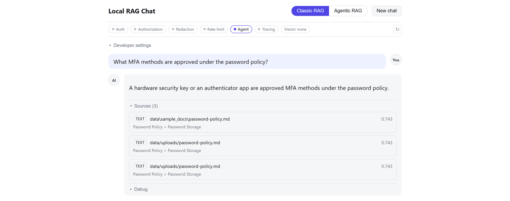

# Web UI

--8<-- "README.md:docs-web-ui"

*A real `POST /query` round trip against the sample corpus: the feature-flags
bar confirms which security controls are active, and the sources panel shows
the actual retrieved chunks with scores and section paths.*

--8<-- "README.md:docs-web-ui-setup"

Architectural notes for the same-origin proxy design, POST-based event
stream parser, live-events-disabled fallback, and error taxonomy are in
`CLAUDE.md`'s "Web UI" section. Full setup, authentication behavior, and
known limitations are in `frontend/README.md` in the repository. The
frontend has its own `package.json` and tests; it is not part of the
Python package this reference section documents.
